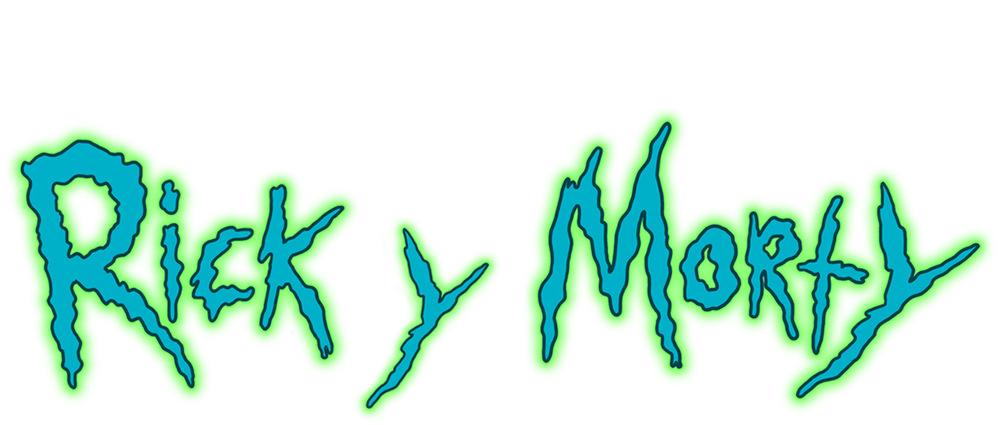

<div>
    
</div>

## Overview ##
This project is a **web application** that uses an **API to display information** about characters, episodes and locations for the famous television series **Rick and Morty**. This web application is build using structure of HTML, CSS for the styling, Typescript for the logic. 

The main objective was to create an **entertaining and informative website to explore more information about Rick & Morty** series and put on practice all we have learned on the last two months in Assembler Institute of Techonology.

## Objective ##
* Obtain information from third-party API’s
* Improve your knowledge of HTML, CSS and Javascript
* Introduce typescript in your code.
* Learn more about how to integrate API's and its interaction with the client
* Improve your skills in obtaining asynchronous information by using AJAX
* Structure a WEB project in a clear and orderly manner

## Konwledge Implementation ##
* **HTML:** Implementation of new structure of Bootstrap, new tags, management.
* **CSS:** Implementation of CSS from an own design and also elements from BootStrap website and to be able an customize elements
* **TS:** Becoming familiar with all concepts of typing information

## Features ##
Information that you should obtain from the API of each section:

**Episodes Guide:** In this section you will explore a list of episodes, proving details like: 
* Name
* Air date
* Episode code

**Characters:**
In this section you will explore a list of characters. Each character display a card information proving details like: 
* Name
* Status
* Species
* Gender 
* Image

**Locations:**
Finally, this section application provides information about locations featured in the show. 
* Name
* Type
* Dimension

## Installation ## 
Before starting the project, make sure that you have all the implementation installed on your Visual Studio Code. 
Also, you need to include Bootstrap’s compiled CSS or JS, or you can use jsDelivr. Here is attached the code to install Bootstrap via CDN in your CSS style sheet:

```
<link href="https://cdn.jsdelivr.net/npm/bootstrap@5.3.1/dist/css/bootstrap.min.css" rel="stylesheet" integrity="sha384-4bw+/aepP/YC94hEpVNVgiZdgIC5+VKNBQNGCHeKRQN+PtmoHDEXuppvnDJzQIu9" crossorigin="anonymous">

<script src="https://cdn.jsdelivr.net/npm/bootstrap@5.3.1/dist/js/bootstrap.bundle.min.js" integrity="sha384-HwwvtgBNo3bZJJLYd8oVXjrBZt8cqVSpeBNS5n7C8IVInixGAoxmnlMuBnhbgrkm" crossorigin="anonymous"></script>
```
## Challenges ## 
During all the project I had different challenges (not just a technique level, but also a personal one), here is attached a list of them: 

- **Vision:** During the project I felt that I haven't the global vision of all the steps to do. In many stages of the project I felt that I didn't know what I had to do or how to start or how to connect different sections to print information on the main display. 

- **Practice:** It's a challenge to be able to do a project that includes different concepts like HTML, CSS, TS with only a few weeks of videos, a quiz and just ONE pill. Because I understand all the concepts (or almost all), but  I stayed blocked before to start writing code or I have too much respect to made errors or I tried but I wasn't able to understand the message of console and it was frustating.

- **Sintaxy error:** During the project I made a lot of sintaxy error, and sometimes I felt sofocated because I was not able to understand where the problem was or why it wasn't working.

- **Work with functions:** As I said on vision, one of the main problems (not in this project in general) was to have vision to see the road of all the steps. So, this problem created that I wasn't able to structure the code by simple functions and related between them to get a much bigger functionality. 

In consequence, when I realized about that I had a "function init" with (not less than 100 lines of code), so I started again the project trying to separate all to do it in a simple function.

- **Request API with Typescript (and structure async):** Use the structure of API (fetch) with Typescript and "async" was a real challenge, because it was difficult with "fetch" structure simple but altogether was almost impossible. I have had to see several times CODE LIVE to understand it, but I knew that it was necesary to have good practice. 

## Conclusion ##
As I said, it's a tough project but necessary to implement all the concepts of HTML, CSS, JS & TS that we have learned on Assembler. I feel satisfied because I accomplished all the requirements in the best way that I knew, so I hope that you like it.
